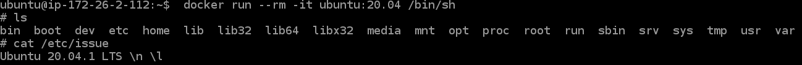
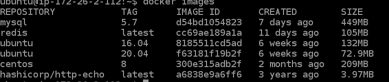

# Docker
도커(Docker) 인프런 도커 입문 학습 내용 정리

# 1. 도커란 무엇인가?
> 도커는 컨테이너 기반의 오픈소스 가상화 플랫폼.
---
## 1. 리눅스 컨테이너
> 도커에 대해서 이해를 하기 위해서는 리눅스 컨테이너에 대해서 알아야한다.

리눅스 컨테이너는 운영체제 수준의 가상화 기술로 리눅스 커널을 공유하며, 프로세스를 격리된 환경에서 실행시키는 기술이다.

### 리눅스 컨테이너의 특징

- **운영체제 수준의 가상화**: 별도의 하드웨어 에뮬레이션 없이 리눅스 커널을 공유해 컨테이너를 실행, 게스트 OS 관리가 필요없음.
- **빠른 속도와 효율성**: 하드웨어 에뮬레이션이 없기 때문에 빠르게 실행. 프로세스 격리를 위해 약간의 오버헤드가 있지만 일반적인 프로세스 실행과 차이 없음.
- **높은 이식성**: 모든 컨테이너는 호스트의 환경이 아닌 독자적인 실행 환경을 가지고 있음. 이 환경은 파일로 구성되어 이미지 형식으로 공유 가능
- **상태를 가지지 않음**: 컨테이너가 실행되는 환경은 동립적이기 때문에, 다른 컨테이너에게 영향을 주지 않음.

### 컨테이너의 종류

컨테이너는 **시스템 컨테이너**와 **애플리케이션 컨테이너**로 분리되는데 도커는 애플리케이션 컨테이너에 포함된다. 우리는 도커에 대해 알아볼거니 애플리케이션 컨테이너에 대해 알아보겠다.

애플리케이션 컨테이너는 컨테이너 기술을 통해 하나의 애플리케이션(프로세스)를 실행시키는 것을 목표로 한다. 단 하나의 프로세스만 실행한다는 점에서 확장이 쉽고 관리 요소가 거의 없다.

> 컨테이너를 사용하면 애플리케이션 별로 독자적인 환경을 준비하고 관리하는 것이 가능하기 때문에 서버 컴퓨터를 관리할 필요가 적어진다는 장점으로 컨테이너 기술 활용이 급속도로 확산되고 있는 추세이다.

## 2. 도커의 특징
---
**확장성/이식성**

- 도커가 설치되어 있다면 어디서든 컨테이너를 실행할 수 있음
- 특정 회사나 서비스에 종속적이지 않음
- 쉽게 개발서버를 만들 수 있고 테스트서버 생성도 간편함

**표준성**

- 도커를 사용하지 않는 경우 ruby, NodeJS, Go, PHP로 만든 서비스들의 배포 방식은 제각각 다름
- 컨테이너라는 표준으로 서버를 배포하므로 모든 서비스들의 배포과정이 동일해짐

**이미지**

- 이미지에서 컨테이너를 생성하기 때문에 반드시 이미지를 만드는 과정이 필요
- Dockerfile을 이용하여 이미지를 만들고 처음부터 재현 가능
- 빌드 서버에서 이미지를 만들면 해당 이미지를 이미지 저장소에 저장하고 운영서버에서 이미지를 불러옴

**설정관리**

- 설정은 보통 환경변수로 제어
- MYSQL_PASS=password와 같이 컨테이너를 띄울때 환경변수를 같이 지정
- 하나의 이미지가 환경변수에 따라 동적으로 설정파일을 생성하도록 만들어져야함

**자원관리**

- 컨테이너는 삭제 후 새로 만들면 모든 데이터가 초기화됨
- 업로드 파일을 외부 스토리지와 링크하여 사용하거나 S3같은 별도의 저장소가 필요
- 세션이나 캐시를 memcached나 redis와 같은 외부로 분리

# 2. 도커 설치하고 컨테이너 실행하기
---
## 1. 도커 설치하기
---
도커는 리눅스 컨테이너 기술이라 윈도우나 macOS에 설치하면 가상머신에 설치가됩니다. 이 글에서는 Linux를 기반으로 설치하는 방법에 대해서 정리하겠습니다.

> curl -fsSL https://get.docker.com/ | sudo sh

### sudo 없이 사용

Docker는 root 권한이 필요하여 root가 아닌 사용자가 sudo없이 사용하려면 해당 사용자를 docker 그룹에 추가해야합니다.

> sudo usermod -aG docker $USER # 현재 접속중인 사용자에게 권한주기

## 2. 설치 확인하기

> docker version

도커의 버전 정보는 서버와 클라이언트가 모두 보여야한다.

도커 커맨드를 입력하면 도커 클라이언트가 호스트에 설치된 도커 데몬에서 명령어 처리 후 클라이언트에 출력

## 2. 도커 기본 명령어
---

### run - 컨테이너 실행

> docker run [OPTION] IMAGE[:TAG|@DIGEST] [COMMAND] [ARG...]

- -d : detached mode (백그라운드 모드)
- -p : 호스트와 컨테이너의 포트를 연결
- -v : 호스트와 컨테이너의 디렉토리를 연결
- -e : 컨테이너 내에서 사용할 환경변수 설정
- --name : 컨테이너 이름 설정
- --rm : 프로세스 종료시 컨테이너 자동 제거
- -it : -i와 -t를 동시에 사용한 것으로 터미널 입력
- --network : 네트워크 연결
- --link : 컨테이너 연결 [컨테이너명:별칭]

**예시**

> docker run ubuntu:20.04

run 명령어 사용 시 이미지가 있는지 없는지 체크 후 이미지가 없다면 다운로드(pull) 후 컨테이너를 생성(create) 그리고 시작(start)

컨테이너는 정상적으로 실행되었지만 다른 추가 명령어가 없기 때문에 바로 종료(컨테이너는 프로세스이기 때문에 실행중인 프로세스가 없으면 종료 됨)

> docker run --rm -it ubuntu:20.04 /bin/sh

-it 옵션을 추가하여 터미널에서 /etc/issue 파일 확인. 종료시 --rm 명령어 때문에 삭제.

> docker run --rm -p 5678:5678 hashicorp/http-echo -text="hello world"

-p 옵션을 통해 hashicorp/http-echo 컨테이너 포트와 호스트 포트를 5678로 연결

> curl localhost:5678

curl 명령어를 통해 해당 포트에 접속하면 hello world라는 텍스트가 출력

**예시2 Redis 실행**

> docker run --rm -p 1234:6379 redis

**예시3 MySQL 실행**

> docker run -d -p 3306:3306 \
>   -e MYSQL_ALLOW_EMPTY_PASSWORD=true \
>   --name mysql \
>   mysql:5.7

- -d 옵션을 통해 백그라운드 모드로 실행 
- -e 옵션을 통해 MYSQL 패스워드 생략 환경변수 설정 
- --name 옵션을 통해 컨테이너 이름 mysql 로 지정

> docker exec -it mysql mysql

- exec 옵션은 컨테이너 내부에서 커맨드를 수행하도록 외부에서 입력 (docker exec [OPTION] [컨테이너 이름 혹은 아이디의 앞부분] [커맨드])
- 보통 컨테이너가 실행중일 때 해당 컨테이너에 명령어를 실행시키고 싶을 때 사용

### ps 명령어

> docker ps

실행중인 컨테이너 목록을 확인

> docker ps -a

중지 된 컨테이너 포함한 목록을 확인

### stop 명령어

> docker stop [OPTION] CONTAINER

실행중인 컨테이너를 중지하는 명령어(띄어쓰기를 통해 여러개 중지 가능)

### rm 명령어

> docker rm [OPTIONS] CONTAINER

종료된 컨테이너를 완전히 제거하는 명령어

> docker logs [OPTIONS] CONTAINER

컨테이너의 로그를 확인하는 명령어

- -f 옵션 : 대기하면서 추가적인 로그가 생기면 계속해서 보여줌
- --tail [line] 옵션 : 원하는 줄 수 출력

### images 명령어

> docker images

도커가 다운로드한 이미지 목록을 보는 명령어

### pull 명령어

> docker pull [OPTIONS] NAME[:TAG|@DIGEST]

이미지 다운로드 명령어

#### 예시

> docker pull ubuntu:18.04

run 명령어를 사용하면 이미지가 없다면 자동으로 pull 해준다.

### network create 명령어

> docker network create [OPTIONS] NETWORK

도커 컨테이너끼리 이름으로 통신할 수 있는 가상 네트워크를 만듬

#### 예시

> docker network create app-network

> docker network connect app-network mysql

app-network라는 네트워크 생성 후 mysql을 네트워크에 연결

### volume mount (-v) 명령어

컨테이너가 사라지면 컨테이너에서 생성된 파일이 모두 사라지기 때문에 데이터 볼륨을 컨테이너에 추가해서 사용해야한다.

> docker run -d -p 3306:3306 \  
>  -e MYSQL_ALLOW_EMPTY_PASSWORD=true \  
>  --name mysql \  
>  -v /my/test/dir:/var/lib/mysql \  
>  mysql:5.7

이전에 mysql 생성하는곳에 -v 옵션을 주었다. 호스트의 /my/test/dir 디렉토리를 컨테이너의 /var/lib/mysql 디렉토리로 마운트 하였다.

호스트 경로에 가보면 해당 데이터가 호스트에 저장되는것을 알 수 있다.

